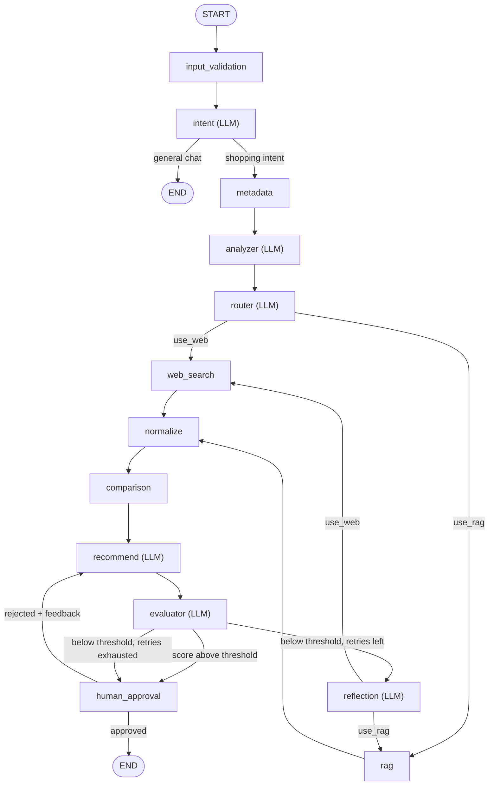

# AI Shopping Assistant Agent

An agentic laptop-shopping assistant built on **LangGraph**: it extracts requirements from a natural-language request, searches the web and/or a local knowledge base, self-evaluates and refines its own recommendation, then pauses for human approval before finalizing — served via a FastAPI backend with a React chat frontend.

## Why this project

Most "AI agent" demos are a single LLM call with tool access. This one behaves closer to a real product:

- **Self-correcting**: an evaluator scores every recommendation against explicit criteria; below threshold, a reflection node diagnoses what's missing and triggers a targeted re-search, bounded to a fixed number of attempts.
- **Not unilateral**: every recommendation pauses for human approval via LangGraph's `interrupt()`/checkpoint mechanism — rejecting with feedback sends it back through recommendation and evaluation again.
- **Resumable, not just conversational**: state is checkpointed per `thread_id`; approval happens over separate HTTP calls (`POST /query`, then `POST /resume/{thread_id}`), not a single request/response turn.
- **Validated at every boundary**: guardrails reject bad input before it reaches the LLM, validate tool arguments before a paid API call, and filter incomplete tool results before they can corrupt state.

## Architecture



`human_approval` is an `interrupt()` — the graph literally suspends execution and persists state via a LangGraph checkpointer until a `Command(resume=...)` is delivered, potentially in a completely separate process/request. The `intent` node runs first and short-circuits straight to `END` for non-shopping messages, so a "hi" gets a normal reply instead of a hard rejection or a full pipeline run. `comparison` is a plain Python step (no LLM call) that runs a registered tool to identify the cheapest/most expensive candidate whenever there are 2+ products, giving `recommend` a grounded fact instead of an eyeballed guess.

## Highlights

- **Self-correcting quality loop**: an evaluator scores each recommendation; a separate conditional edge decides proceed/reflect/degrade based on the score and retry count.
- **Real human-in-the-loop**: built on LangGraph's `interrupt()` + checkpointing, not a fake "confirm" button — approval happens over separate HTTP calls, validated against actual graph state (404/409) before resuming.
- **Guardrails at every boundary**: input, tool-argument, and tool-result validation are isolated modules, never inline logic.
- **Bounded retry for structured output**: a shared `invoke_structured()` helper retries LLM calls that omit a required field, instead of every node reimplementing its own retry logic.
- **One synchronization point for fan-out**: LangGraph only joins branches that complete in the same superstep — fixed an early bug where uneven hop-counts silently double-invoked downstream nodes.
- **Consistent error contract**: a dedicated exception handler reshapes every error path — validation, HTTP, unexpected 500s — into the same `{"error": {"code", "message"}}` shape.
- **Swappable LLM provider**: a single `get_llm()` factory lets every node switch between Groq and OpenAI with a one-function change.

## Tech stack

| Layer | Choice |
|---|---|
| Agent orchestration | [LangGraph](https://github.com/langchain-ai/langgraph) 1.2.11 + [LangChain](https://github.com/langchain-ai/langchain) 1.4.0 |
| LLM (chat / structured output) | Groq (`openai/gpt-oss-120b`) or OpenAI (`gpt-5.4-mini`), swappable via `core/llm.py` |
| Embeddings | Google Gemini (`gemini-embedding-001`) via `langchain-google-genai` |
| Vector store (RAG) | Qdrant, embedded/local mode |
| Web search tool | Tavily |
| Validation / schemas | Pydantic v2, `pydantic-settings` |
| Backend API | FastAPI + Uvicorn (synchronous JSON, no streaming) |
| Frontend | React 19 + TypeScript + Vite, Tailwind CSS |
| Language detection | py3langid |
| Testing | pytest (73 tests: schemas, guards, RAG, graph routing, HITL/checkpoint, API) |

## Project structure

```
backend/app/
├── cli.py            CLI entrypoint: python -m app.cli "<question>"
├── main.py            FastAPI app factory (lifespan-managed graph singleton, CORS, exception handlers)
├── core/               Shared infrastructure: config, LLM factory, structured-output retry, logging/events, checkpointer
├── graph/              ShoppingState schema, build_graph(), and one file per node (incl. intent classification)
├── tools/              External tool registry (web search, product comparison, currency conversion) — validated, single point of truth
├── guards/             Input / tool-argument / tool-result validation, isolated from node logic
├── rag/                Ingestion, embeddings, vector store, retrieval — independent of the graph
├── prompts/            One prompt file per LLM-backed node
├── schemas/            Internal Pydantic contracts (requirements, product, recommendation, evaluation, reflection, intent)
├── api/                FastAPI routers + HTTP-facing DTOs (separate from internal schemas/)
└── evals/              Offline golden-query evaluation script, separate from the runtime evaluator node

frontend/src/
├── App.tsx             Chat UI shell, turn rendering
├── hooks/               useShoppingConversation — conversation state machine
├── api/                  Typed HTTP client for the backend
├── components/           Chat bubbles, recommendation card, approval controls, error banner
└── types/                DTOs mirrored from the backend, field-for-field
```

## Getting started

### Backend

```bash
cd backend
python -m venv .venv
./.venv/Scripts/activate   # Windows; use source .venv/bin/activate on macOS/Linux
pip install -r requirements.txt
cp .env.example .env
```

Fill in `.env`:

| Key | Used for |
|---|---|
| `GOOGLE_API_KEY` | RAG embeddings |
| `TAVILY_API_KEY` | Web search |
| `GROQ_API_KEY` | Chat / structured output |
| `OPENAI_API_KEY` | Chat / structured output (alternate provider) |

Build the RAG index (drop `.pdf`/`.md` files into `data/knowledge/` first):

```bash
python -m app.rag.vectorstore
```

Run via CLI:

```bash
python -m app.cli "laptop under 25 million VND for AI development and gaming"
```

The CLI pauses for approval (`Approve this recommendation? [y/n]`) before printing the final result — reject with feedback to have the agent regenerate.

Run the API:

```bash
uvicorn app.main:app --reload
```

```bash
curl -X POST http://127.0.0.1:8000/api/v1/shopping/query \
  -H "Content-Type: application/json" \
  -d '{"query": "laptop under 25 million VND for AI development and gaming"}'
# -> { "thread_id": "...", "status": "pending_approval", "data": {...} }

curl -X POST http://127.0.0.1:8000/api/v1/shopping/resume/<thread_id> \
  -H "Content-Type: application/json" \
  -d '{"approved": true, "feedback": null}'
# -> { "thread_id": "...", "status": "done", "data": {...} }
```

`approved: false` with `feedback` regenerates the recommendation and returns `pending_approval` again — repeat until `status == "done"`. Errors follow `{"error": {"code", "message"}}`: 400 (invalid query), 404 (unknown `thread_id`), 409 (thread already finished).

Run tests:

```bash
pytest -v
```

Deterministic tests (schemas, guards, HITL/checkpoint mechanics, routing logic, 400/404 API cases) run without any API key. Tests exercising live LLM/search calls skip automatically if the corresponding key is missing, and are subject to each provider's quota.

### Frontend

```bash
cd frontend
npm install
cp .env.example .env.development   # VITE_API_BASE_URL, defaults to http://127.0.0.1:8000
npm run dev
```

Open the printed local URL with the backend running — the chat UI talks to it exclusively through `/api/v1/shopping/*`.