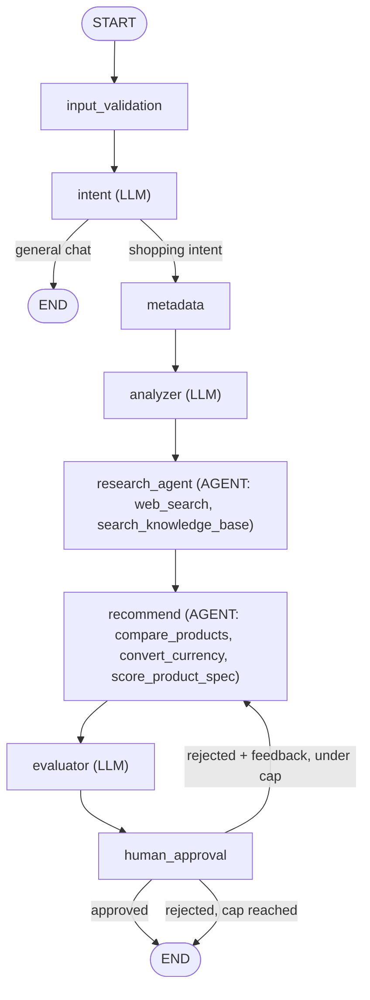

# AI Shopping Assistant Agent

A laptop-shopping assistant built on **LangGraph** and **LangChain's `create_agent`**: it extracts requirements from a natural-language request, has a real tool-calling agent research the web and/or a local knowledge base, has a second agent produce a recommendation (optionally comparing prices/converting currency itself), self-evaluates and refines that recommendation, then pauses for human approval before finalizing — served via a FastAPI backend with a React chat frontend.

## Why this project

Most "AI agent" demos are a single LLM call with tool access. This one is a hybrid: two points in the graph are genuine agents (the LLM decides which tools to call, how many times, and when to stop), while everything else is deterministic workflow code — on purpose, not by accident:

- **Real tool-calling agents where it matters**: `research_agent` decides for itself whether to search the web, query the local knowledge base, both, or repeat with a different query — it isn't told which source to use. `recommend` decides for itself whether to call a price-comparison tool or a spec-scoring tool before committing to an answer.
- **Everything else stays deterministic code**: intent classification, requirement extraction, quality scoring, and human-approval routing are plain structured-output LLM calls or pure Python — turning them into agents would only add cost and unpredictability without adding real decision-making.
- **Scored, not just produced**: an evaluator scores every recommendation against explicit criteria (budget fit, purpose fit, data support, internal consistency) and surfaces that score plus concrete feedback alongside the recommendation, instead of presenting it as unconditionally correct.
- **Not unilateral**: every recommendation pauses for human approval via LangGraph's `interrupt()`/checkpoint mechanism — rejecting with feedback sends it back through recommendation and evaluation again, bounded by a safety-valve rejection cap.
- **Resumable, not just conversational**: state is checkpointed per `thread_id`; approval happens over separate HTTP calls (`POST /query`, then `POST /resume/{thread_id}`), not a single request/response turn.
- **Validated at every boundary**: guardrails reject bad input before it reaches the LLM, validate tool arguments before a call, and filter incomplete tool results before they can corrupt state.

## Architecture



`human_approval` is an `interrupt()` — the graph literally suspends execution and persists state via a LangGraph checkpointer until a `Command(resume=...)` is delivered, potentially in a completely separate process/request. The `intent` node runs first and short-circuits straight to `END` for non-shopping messages, so a "hi" gets a normal reply instead of a hard rejection or a full pipeline run.

Both `research_agent` and `recommend` are built with `create_agent(...)` and run their own internal tool-calling loop, but neither uses `create_agent`'s built-in `response_format` — a smaller/local model won't reliably call a forced "final answer" tool, so the agent is left free to answer in plain text and a separate `with_structured_output(..., method="json_mode")` call extracts the final structured result from that answer. See `reference/mapping.md` for the full story (that file isn't tracked in git — it's a personal build log, not project documentation).

## Highlights

- **Real agent boundary, deliberately narrow**: only the two nodes that actually need to choose a tool are agents; everything else is plain LLM calls or pure Python, kept that way on purpose.
- **Explicit quality signal, not a black box**: an evaluator scores each recommendation against stated criteria and surfaces the score plus concrete feedback to the human approving it.
- **Real human-in-the-loop**: built on LangGraph's `interrupt()` + checkpointing, not a fake "confirm" button — approval happens over separate HTTP calls, validated against actual graph state (404/409) before resuming.
- **Guardrails at every boundary**: input, tool-argument, and tool-result validation are isolated modules, never inline logic.
- **Bounded retry for structured output**: shared `invoke_structured()`/`invoke_agent()` helpers retry LLM calls that omit a required field or fail to produce structured output, instead of every node reimplementing its own retry logic.
- **Consistent error contract**: a dedicated exception handler reshapes every error path — validation, HTTP, unexpected 500s — into the same `{"error": {"code", "message"}}` shape.
- **Swappable LLM provider**: a single `get_llm()` factory switches between NVIDIA NIM, Ollama (fully local), Groq, and OpenAI with one setting — no code changes.

## Tech stack

| Layer | Choice |
|---|---|
| Agent orchestration | [LangGraph](https://github.com/langchain-ai/langgraph) 1.2.11 + [LangChain](https://github.com/langchain-ai/langchain) 1.4.0 (`create_agent`) |
| LLM (chat / structured output) | **NVIDIA NIM** (`openai/gpt-oss-20b`, default) — or Ollama (fully local, no key), Groq, OpenAI, swappable via `core/llm.py` |
| Embeddings | Ollama (`nomic-embed-text`, local, no key) |
| Vector store (RAG) | Qdrant, embedded/local mode |
| Web search tool | Tavily |
| Validation / schemas | Pydantic v2, `pydantic-settings` |
| Backend API | FastAPI + Uvicorn (synchronous JSON, no streaming) |
| Frontend | React 19 + TypeScript + Vite, Tailwind CSS |
| Language detection | py3langid |
| Testing | pytest (unit tests run with no API key at all except `TAVILY_API_KEY` for a few full-flow cases) |

## Project structure

```
backend/app/
├── cli.py            CLI entrypoint: python -m app.cli "<question>"
├── main.py            FastAPI app factory (lifespan-managed graph singleton, CORS, exception handlers)
├── core/               Shared infrastructure: config, LLM factory, structured-output/agent-invoke retry, logging/events, checkpointer
├── graph/              ShoppingState schema, build_graph(), and one file per node
├── tools/              External tool registry (web search, RAG search, compare, currency, spec score) + LangChain-native adapters for the 2 agents
├── guards/             Input / tool-argument / tool-result validation, isolated from node logic
├── rag/                Ingestion, embeddings, vector store, retrieval — independent of the graph
├── prompts/            One prompt file per LLM-backed node
├── schemas/            Internal Pydantic contracts (requirements, product, research, recommendation, evaluation, intent)
└── api/                FastAPI routers + HTTP-facing DTOs (separate from internal schemas/)

frontend/src/
├── App.tsx             Chat UI shell, turn rendering
├── hooks/               useShoppingConversation — conversation state machine (in-memory, no persistence)
├── api/                  Typed HTTP client for the backend
├── components/           Chat bubbles, recommendation card, approval controls, error banner
└── types/                DTOs mirrored from the backend, field-for-field
```

## Getting started

### Backend

```bash
cd backend
python -m venv .venv
./.venv/Scripts/activate   # Windows; use source .venv/bin/activate on macOS/Linux
pip install -r requirements.txt
cp .env.example .env
```

Fill in `.env`:

| Key | Used for |
|---|---|
| `TAVILY_API_KEY` | Web search — the only external dependency with no local alternative |
| `NVIDIA_API_KEY` | Chat LLM (default provider) — get one at [build.nvidia.com](https://build.nvidia.com) |
| `GROQ_API_KEY` / `OPENAI_API_KEY` | Only needed if you switch `LLM_PROVIDER` to `groq`/`openai` |

No key is needed for `LLM_PROVIDER=ollama` (fully local) or for embeddings (always local via Ollama).

Pull the local embedding model (always required, regardless of chat provider):

```bash
ollama pull nomic-embed-text
```

Build the RAG index (drop `.pdf`/`.md` files into `data/knowledge/` first, or after changing the embedding model):

```bash
python -m app.rag.vectorstore
```

Run via CLI:

```bash
python -m app.cli "laptop under 25 million VND for AI development and gaming"
```

The CLI pauses for approval (`Approve this recommendation? [y/n]`) before printing the final result — reject with feedback to have the agent regenerate.

Run the API:

```bash
uvicorn app.main:app --reload
```

```bash
curl -X POST http://127.0.0.1:8000/api/v1/shopping/query \
  -H "Content-Type: application/json" \
  -d '{"query": "laptop under 25 million VND for AI development and gaming"}'
# -> { "thread_id": "...", "status": "pending_approval", "data": {...} }

curl -X POST http://127.0.0.1:8000/api/v1/shopping/resume/<thread_id> \
  -H "Content-Type: application/json" \
  -d '{"approved": true, "feedback": null}'
# -> { "thread_id": "...", "status": "done", "data": {...} }
```

`approved: false` with `feedback` regenerates the recommendation and returns `pending_approval` again — repeat until `status == "done"`. Errors follow `{"error": {"code", "message"}}`: 400 (invalid query), 404 (unknown `thread_id`), 409 (thread already finished).

Run tests:

```bash
pytest -v
```

Deterministic tests (schemas, guards, HITL/checkpoint mechanics, routing logic, 400/404 API cases) run with no API key at all. A handful of full-flow tests need `TAVILY_API_KEY` and skip automatically if it's missing.

### Frontend

```bash
cd frontend
npm install
cp .env.example .env.development   # VITE_API_BASE_URL, defaults to http://127.0.0.1:8000
npm run dev
```

Open the printed local URL with the backend running — the chat UI talks to it exclusively through `/api/v1/shopping/*`. There's no streaming and no client-side persistence by design — refreshing the page starts a new conversation.
